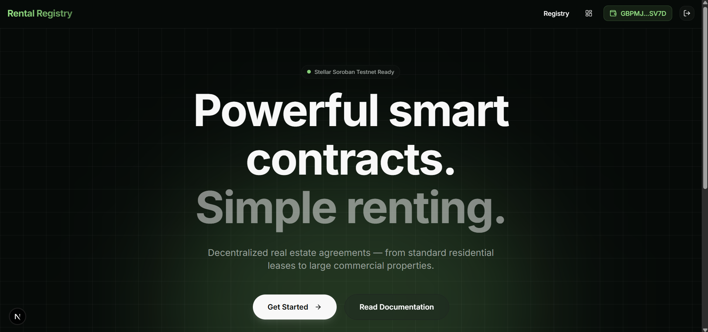
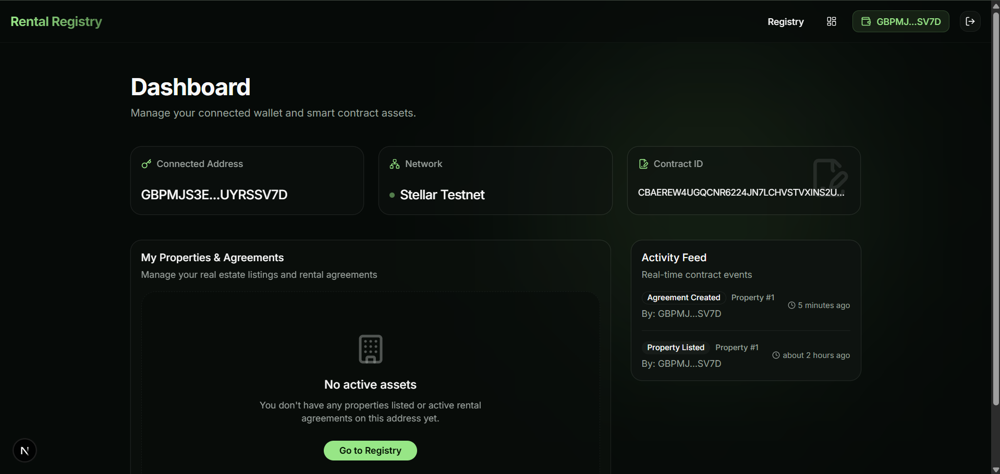
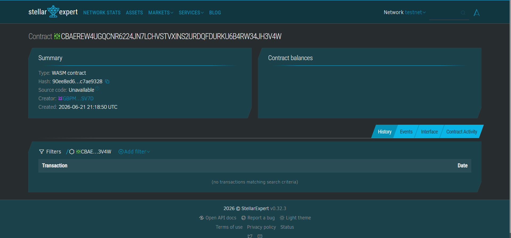

# Decentralized Real Estate Rental Registry 🏘️



A cutting-edge Stellar Level 2 DApp demonstrating advanced smart contract integration using Soroban. Built to revolutionize property management, allowing owners to securely list properties and tenants to initiate immutable rental agreements on the Stellar blockchain.

---

## 🔗 Live Contract Deployment

The core business logic of this application is powered by a robust Rust-based Soroban Smart Contract.

**Network**: Stellar Testnet  
**Contract ID**: `CBAEREW4UGQCNR6224JN7LCHVSTVXINS2URDQFDURKU6B4RW34JH3V4W`  
**Stellar Expert Explorer**: [View Deployed Contract](https://stellar.expert/explorer/testnet/contract/CBAEREW4UGQCNR6224JN7LCHVSTVXINS2URDQFDURKU6B4RW34JH3V4W)

---

## ✨ Key Features

* **Wallet Integration:** Secure login and transaction signing utilizing `StellarWalletsKit` natively integrated with the Freighter Wallet.
* **Soroban Smart Contracts:** Fully decentralized business logic for listing properties, signing leasing agreements, and facilitating secure rent payments.
* **Real-time Ledger Interaction:** Read state directly from the Stellar ledger and seamlessly submit transactions via your connected wallet.
* **SaaS-Grade UI:** A sleek, dark-themed "Trustless" aesthetic built with Next.js 15, Tailwind CSS, and shadcn/ui. Featuring glassmorphism, dynamic gradients, and professional typography.

---

## 📸 Application Previews

### Wallet Dashboard & Asset Management
*Manage your connected address, view your native balances, and review transaction histories.*


### Smart Contract Integration
*Interact seamlessly with Soroban to deploy agreements and list real estate.*


---

## 🛠️ Technology Stack

| Category | Technologies |
| :--- | :--- |
| **Frontend Framework** | Next.js 15 (App Router), React, TypeScript |
| **Styling & UI** | Tailwind CSS, shadcn/ui, Lucide Icons |
| **State Management** | Zustand |
| **Web3 & Blockchain** | `@stellar/stellar-sdk`, `@creit.tech/stellar-wallets-kit` |
| **Smart Contract** | Rust, Soroban SDK |

---

## 🚀 Getting Started

### Prerequisites
1. **Node.js** (v18+ recommended)
2. **Freighter Wallet Extension** installed in your browser. (Ensure you switch the network to **Testnet**).
3. Testnet XLM (You can fund your wallet via the [Stellar Laboratory Faucet](https://laboratory.stellar.org/#account-creator?network=test)).

### 1. Clone & Install
```bash
git clone <your-repo-url>
cd real-estate-rental-agreement-registry
npm install
```

### 2. Environment Variables
Ensure your `.env.local` is configured with the correct Testnet details:
```env
NEXT_PUBLIC_CONTRACT_ID=CBAEREW4UGQCNR6224JN7LCHVSTVXINS2URDQFDURKU6B4RW34JH3V4W
NEXT_PUBLIC_NETWORK_PASSPHRASE="Test SDF Network ; September 2015"
NEXT_PUBLIC_RPC_URL="https://soroban-testnet.stellar.org"
```

### 3. Run Development Server
```bash
npm run dev
```
Navigate to `http://localhost:3000` to interact with the decentralized registry!

---

## 📜 Smart Contract Deployment (Optional)
If you wish to compile and deploy your own instance of the smart contract:
1. Navigate to the `contracts/rental_registry` directory.
2. Compile the Rust contract to `.wasm` using the Soroban CLI.
3. Deploy to the Stellar Testnet.
4. Update the `NEXT_PUBLIC_CONTRACT_ID` in your `.env.local` file with your new contract ID.

---
*Built for the future of decentralized real estate.*
